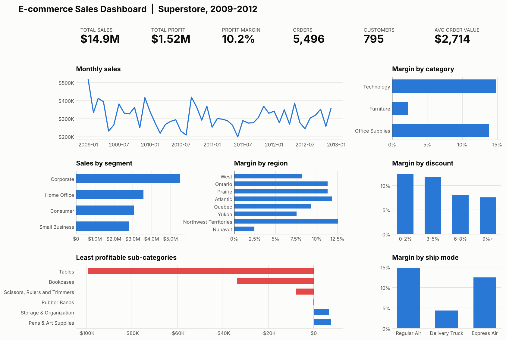
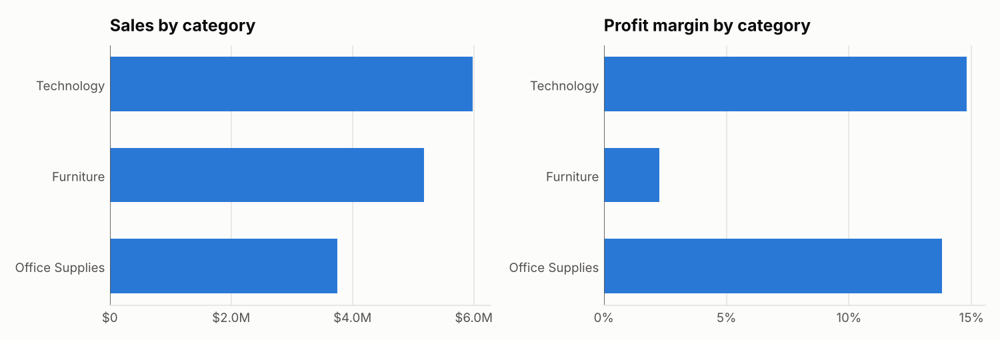
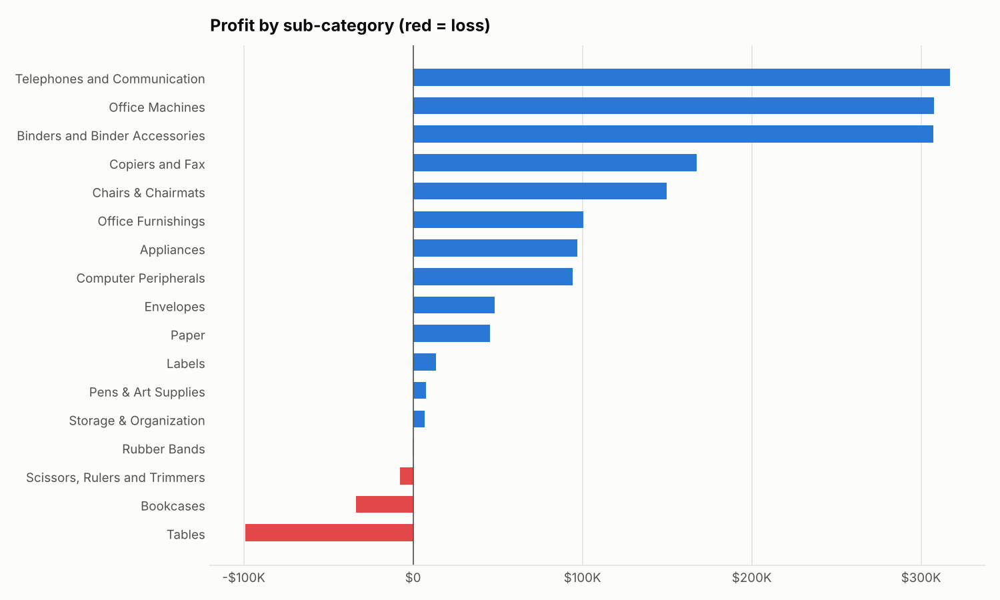
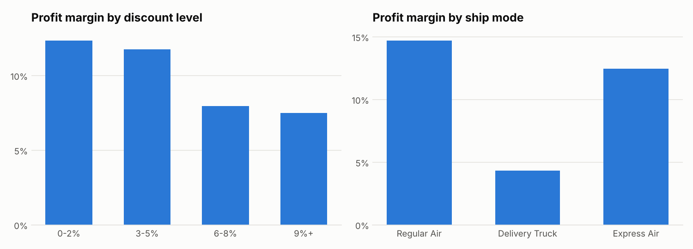
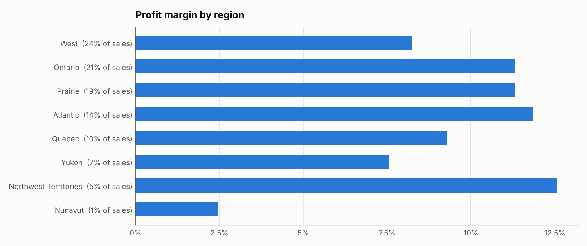
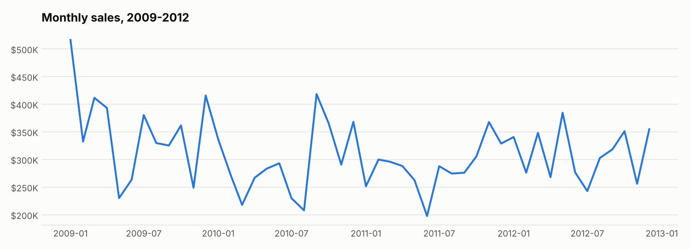

# E-commerce Sales Analysis

Commercial analytics project exploring sales performance, customer purchasing trends and profitability through data-driven insights.



## Overview
In this case study, I explore an e-commerce sales dataset to understand how different parts of a business contribute to its overall performance. By analysing sales, profitability and customer purchasing patterns, I wanted to move beyond reporting numbers and uncover the story behind the business.

The analysis brings together summary tables, charts and a one-page dashboard to highlight trends, spot opportunities and share the insights in a clear and meaningful way. If you're short on time, the dashboard above and the [Key Findings](#key-findings) below tell most of the story.

## Dataset
The project uses the well-known **Superstore Sales** sample dataset, which Tableau published as practice data. It covers a fictional Canadian office-supplies retailer and contains **8,399 order lines** across **5,496 orders** and **795 customers**, placed between **January 2009 and December 2012**. All values are in US dollars.

Each row is a single product on an order, with details such as:

- **Order:** order date, ship date, priority, ship mode, quantity and discount
- **Customer:** name, segment (Corporate, Home Office, Consumer, Small Business), province and region
- **Product:** category, sub-category, product name, container type and base margin
- **Results:** sales, profit, unit price and shipping cost

Bringing these elements together made it possible to look at performance from several angles rather than focusing on a single metric. Instead of producing descriptive statistics alone, the dataset gave me a chance to investigate how different areas of the business were performing, find patterns in customer purchasing behaviour and explore what drives sales and profitability.

Source: [curran/data – superstoreSales](https://github.com/curran/data/tree/gh-pages/superstoreSales), a copy of Tableau's Superstore sample data.

## Approach
Before building anything, I spent time getting to know the dataset: its structure, how the variables relate to each other and what questions the data could really answer. I wanted to understand which measures would give the clearest picture of business performance before reaching for visualisations.

**1. Cleaning and preparation.** The raw file needed a little care before analysis. It uses older Mac line endings and Windows-1252 text encoding, it has a blank trailing row, and the "Prairie" region is misspelt as "Prarie". After tidying these up I added a few helper fields: order year and month, days to ship, profit margin, a discount band, and a flag for loss-making order lines.

**2. Breaking the business down.** I then looked at each area of the business in turn: sales over time, product categories and sub-categories, customer segments, regions, shipping, discounting and customer concentration. Looking at each area on its own made it easier to compare performance and notice patterns that can get lost when you only look at the whole.

**3. Bringing it together.** Finally, I combined the most useful measures into a single dashboard, with an Excel workbook alongside it for anyone who wants to dig deeper.

The whole pipeline is a single Python script, [`src/analysis.py`](src/analysis.py), so every number and chart can be reproduced from the raw data.

Throughout the project, my aim wasn't just to make charts but to understand what the analysis revealed and to explain it in a way anyone could follow. I wanted the dashboard to work for a wide audience, from business stakeholders to people who have never seen the dataset before. To me, good analysis isn't only about finding insights. It's also about sharing them in a way that supports understanding and good conversations.

## Dashboard
The dashboard pulls the key findings into a single view. It gives an overview of sales, profitability and customer activity through a row of headline KPIs and a set of focused charts.

Rather than showing every metric available, it focuses on the measures that give the clearest picture of how the business is doing:

- **Headline KPIs:** total sales, total profit, profit margin, orders, customers and average order value
- **Monthly sales trend** across the four years
- **Profit margin** by product category, region, discount level and ship mode
- **Sales by customer segment**
- **The least profitable sub-categories**, with loss-makers highlighted in red

The workbook [`outputs/ecommerce_sales_analysis.xlsx`](outputs/ecommerce_sales_analysis.xlsx) contains the same dashboard built with native Excel charts, one summary sheet per area of the business, and the full cleaned dataset as an Excel Table (`SalesData`). That makes it easy to add your own PivotTables and slicers to explore further.

## Key Findings

**1. A $14.9M business earning a 10.2% margin, though half of its order lines lose money.**
Over four years the store made $14.9M in sales and $1.52M in profit. Underneath that healthy headline, **51% of individual order lines were loss-making**, and the median line lost $1.50. Profit is being carried by a smaller set of strong orders, so there's real room to improve.

**2. Technology does the heavy lifting, while Furniture sells well but earns very little.**



Technology brings in 40% of sales at a **14.8% margin** and generates $886K of the $1.52M total profit. Office Supplies is similarly efficient at 13.8%. Furniture, though, accounts for 35% of sales but returns only a **2.3% margin**, just $117K in profit.

**3. Tables and Bookcases are losing money outright.**



Tables are the store's third-largest sub-category by sales ($1.9M), yet they **lost $99K**. Bookcases lost a further $34K, and Scissors, Rulers & Trimmers and Rubber Bands also finished below zero. At the other end, small, low-cost lines punch well above their weight: Labels (35% margin), Binders (30%) and Envelopes (28%) are among the most profitable products per dollar sold. Tables carry the same average discount as everything else (about 5%), so the losses seem to come from pricing and cost rather than heavier discounting.

**4. Deeper discounts quietly erode margin.**



Orders discounted by 0–5% earn a margin of around 12%. Once discounts reach 6% or more, margin drops to **7.5–8%**, roughly a third lower, and those orders aren't any bigger in return (average order line value and quantity stay flat or dip slightly). Reviewing discount approval for the higher bands looks like one of the easiest wins available.

**5. Delivery Truck shipments are the least profitable, mostly because of what they carry.**
Regular Air earns a 14.7% margin, but Delivery Truck earns just **4.3%**, despite carrying 42% of all sales. Two-thirds of truck sales are Furniture, so this is largely the Furniture margin problem showing up again, together with the cost of shipping bulky items.

**6. Margins vary widely by region.**



The West is the biggest region (24% of sales), but its 8.3% margin trails Ontario, the Prairie and Atlantic (all above 11%). Nunavut is small, yet it barely breaks even at 2.4%. Had the West matched Ontario's margin, it would have earned roughly **$100K more profit** over the four years on the same sales.

**7. Corporate customers lead, and a small group of customers matters a lot.**
Corporate customers account for 37% of sales, the largest segment by some distance, and Small Business customers deliver the best margin (11.3%). Customer concentration is notable: **the top 10% of customers generate 29% of sales**, and the top 20% generate 46%. Looking after these relationships is clearly worthwhile.

**8. Sales are steady rather than growing.**



Yearly sales stayed between $3.4M and $4.2M, with 2009 the strongest year. Month to month, sales usually sit between $250K and $400K, with peaks around December–January and September–October. The business looks stable, but without a clear growth trend. Fixing the margin issues above would therefore be the most direct way to grow profit.

### Recommendations
- **Review pricing and costs on Tables and Bookcases**, or reconsider how they're sold, since together they cost the business more than $130K.
- **Tighten approvals for discounts above 5%**, where margin falls by about a third.
- **Look at Furniture delivery costs**, for example through minimum order values or delivery charges on bulky items.
- **Learn from Ontario and the Prairie** to lift margin in the West, the largest region.
- **Nurture the top 20% of customers**, who generate almost half of all sales.

## How to run it
You'll need Python 3.9 or later.

```bash
pip install -r requirements.txt
python src/analysis.py
```

This reads `data/raw/superstore_sales.csv` and regenerates:

| Output | What it is |
|---|---|
| `data/processed/superstore_sales_clean.csv` | The cleaned, analysis-ready dataset |
| `outputs/ecommerce_sales_analysis.xlsx` | Excel workbook: dashboard, summary sheets and full data table |
| `images/*.png` | The dashboard and charts used in this README |

## Project structure
```
ecommerce-sales-analysis/
├── data/
│   ├── raw/superstore_sales.csv            # original dataset
│   └── processed/superstore_sales_clean.csv
├── images/                                  # dashboard and charts
├── outputs/ecommerce_sales_analysis.xlsx    # Excel workbook
├── src/analysis.py                          # cleaning, analysis, charts and workbook
├── requirements.txt
└── README.md
```

## Reflection
This project was a good reminder that the headline numbers rarely tell the whole story. A 10% overall margin sounds perfectly healthy, and it was only by breaking the business into its parts that the more interesting picture appeared: a strong Technology range carrying a Furniture range that sells well but earns almost nothing, and half of all order lines losing money.

One of the most valuable habits I took from this was to keep asking "why?". The low margin on Delivery Truck orders first looked like a shipping problem. Following the thread showed it was mostly the Furniture story again, which changes the conversation from "how do we ship more cheaply?" to "how do we price and sell furniture profitably?".

I also learned how much care the data itself deserves before any analysis begins. Small details like file encoding, a misspelt region or a stray blank row are easy to miss, but left alone they quietly break totals and comparisons.

If I took this further, I'd like to:
- look at **customer retention** and repeat purchasing over time, to understand customer lifetime value
- model **how discounts affect order size**, to find the point where a discount stops paying for itself
- break **shipping costs** down by product and region to see where delivery pricing could change
- build an **interactive version** of the dashboard (for example in Power BI or Tableau) with filters by year, region and segment

Above all, I enjoyed turning a spreadsheet of transactions into a story with clear, practical next steps. Thank you for taking the time to read through this project. I hope you found it as interesting as I did!
